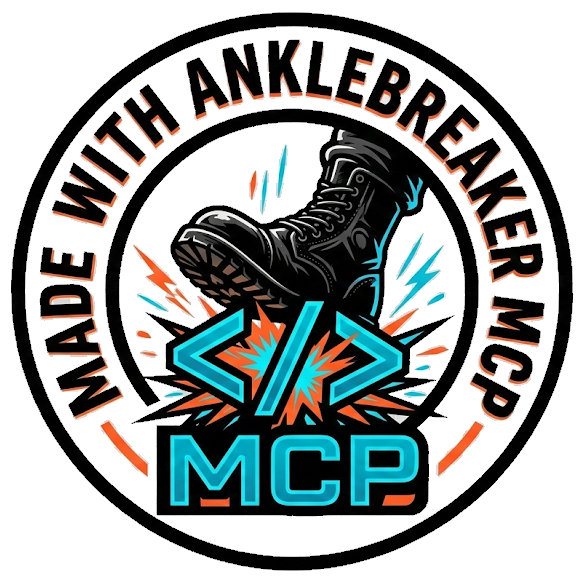

<p align="center">
  
</p>

# Unity MCP Bridge Plugin

A Unity Editor plugin that enables AI assistants (Claude, etc.) to control Unity Editor via the [Model Context Protocol (MCP)](https://modelcontextprotocol.io). Part of the [Unity MCP](https://github.com/AnkleBreaker-Studio) toolchain by AnkleBreaker Studio.

## What It Does

This package runs a lightweight HTTP server inside the Unity Editor on `localhost:7890`. The companion [unity-mcp-server](https://github.com/AnkleBreaker-Studio/unity-mcp-server) connects to it, exposing **200+ tools** to AI assistants across **30+ feature categories**.

**Core Capabilities:**

- **Scene Management** — Open, save, create scenes; browse full hierarchy tree
- **GameObjects** — Create (primitives or empty), delete, inspect, set transforms (world/local)
- **Components** — Add/remove components, get/set any serialized property
- **Assets** — List, import, delete assets; create prefabs and materials; assign materials
- **Scripts** — Create, read, update C# scripts
- **Builds** — Trigger multi-platform builds (Windows, macOS, Linux, Android, iOS, WebGL)
- **Console** — Read errors/warnings/logs, clear console
- **Play Mode** — Play, pause, stop
- **Editor** — Execute menu items, run arbitrary C# code, check editor state, get project info

**Extended Capabilities:**

- **Animation** — List clips, get clip info, list Animator controllers and parameters, set Animator properties, play animations
- **Prefab (Advanced)** — Open/close prefab editing mode, check prefab status, get overrides, apply/revert changes
- **Physics** — Raycasts, sphere/box casts, overlap tests, get/set physics settings (gravity, layers, collision matrix)
- **Lighting** — Manage lights, configure environment lighting/skybox, bake lightmaps, list/manage reflection probes
- **Audio** — Manage AudioSources, AudioListeners, AudioMixers, play/stop clips, adjust mixer parameters
- **Terrain** — Create/modify terrains, paint heightmaps/textures, manage terrain layers, trees, and detail objects
- **Navigation** — NavMesh baking, agents, obstacles, off-mesh links
- **Particles** — Particle system creation, inspection, module editing
- **UI** — Canvas, UI elements, layout groups, event system
- **Tags & Layers** — List tags and layers, add/remove tags, assign tags/layers to GameObjects
- **Selection** — Get/set editor selection, find objects by name/tag/component/layer
- **Graphics** — Scene and game view capture as inline images for visual inspection
- **Input Actions** — List action maps and actions, inspect bindings (Input System package)
- **Assembly Definitions** — List, inspect, create, update .asmdef files
- **ScriptableObjects** — Create, inspect, modify ScriptableObject assets
- **Constraints** — Position, rotation, scale, aim, parent constraints
- **LOD** — LOD group management and configuration

**Profiling & Debugging:**

- **Profiler** — Start/stop profiler, get stats, take deep profiles, save profiler data
- **Frame Debugger** — Enable/disable frame debugger, get draw call list and details, get render target info
- **Memory Profiler** — Memory breakdown by asset type, top memory consumers, take memory snapshots (with `com.unity.memoryprofiler` package)

**Shader & Visual Tools (conditional on packages):**

- **Shader Graph** — List, inspect, create, open Shader Graphs; inspect shader properties; list Sub Graphs and VFX Graphs (requires `com.unity.shadergraph` / `com.unity.visualeffectgraph`)
- **Amplify Shader Editor** — List, inspect, open Amplify shaders and functions (requires Amplify Shader Editor asset)

**Multiplayer (conditional on MPPM package):**

- **MPPM Scenarios** — List, activate, start, stop multiplayer playmode scenarios; get status and player info (requires `com.unity.multiplayer.playmode`)

**Infrastructure:**

- **Multi-Instance Support** — Multiple Unity Editor instances discovered automatically (including ParrelSync clones)
- **Multi-Agent Support** — Multiple AI agents can connect simultaneously with session tracking, action logging, and queued execution
- **Play Mode Resilience** — MCP bridge survives domain reloads during Play Mode via SessionState persistence
- **Dashboard** — Built-in Editor window (`Window > MCP Dashboard`) showing server status, category toggles, agent sessions, and update checker
- **Project Context** — Auto-inject project-specific documentation and guidelines for AI agents (via `Assets/MCP/Context/`)
- **Settings** — Configurable port, auto-start, and per-category enable/disable via EditorPrefs
- **Update Checker** — Automatic GitHub release checking with in-dashboard notification

## Installation via Unity Package Manager

1. Open Unity > **Window** > **Package Manager**
2. Click the **+** button > **Add package from git URL...**
3. Enter:
   ```
   https://github.com/AnkleBreaker-Studio/unity-mcp-plugin.git
   ```
4. Click **Add**

Unity will download and install the package. You should see in the Console:
```
[MCP Bridge] Server started on port 7890
```

### Verify

Open a browser and visit: `http://127.0.0.1:7890/api/ping`

You should see JSON with your Unity version and project name.

## Companion: MCP Server

This plugin is one half of the system. You also need the **Node.js MCP Server** that connects Claude to this bridge:

👉 [unity-mcp-server](https://github.com/AnkleBreaker-Studio/unity-mcp-server)

## Dashboard

Open **Window > MCP Dashboard** to access:

- Server status with live indicator (green = running, red = stopped)
- Start / Stop / Restart controls
- Per-category feature toggles (enable/disable any of the 30+ categories)
- Port and auto-start settings
- Active agent session monitoring
- Version display with update checker

## Requirements

- Unity 2021.3 LTS or newer (tested on 2022.3 LTS and Unity 6)
- .NET Standard 2.1 or .NET Framework

### Optional Packages

Some features activate automatically when their corresponding packages are detected:

| Package / Asset | Features Unlocked |
|----------------|-------------------|
| `com.unity.memoryprofiler` | Memory snapshots via MemoryProfiler API |
| `com.unity.shadergraph` | Shader Graph create, inspect, open |
| `com.unity.visualeffectgraph` | VFX Graph listing and opening |
| `com.unity.inputsystem` | Input Action maps and bindings inspection |
| `com.unity.multiplayer.playmode` | MPPM scenario management (list, activate, start/stop, status) |
| Amplify Shader Editor (Asset Store) | Amplify shader listing, inspection, opening |

## Configuration

Configuration is managed through the MCP Dashboard (`Window > MCP Dashboard > Settings`):

- **Port** — HTTP server port (default: `7890`)
- **Auto-Start** — Automatically start the bridge when Unity opens (default: `true`)
- **Category Toggles** — Enable/disable any of the 21 feature categories

Settings are stored in `EditorPrefs` and persist across sessions.

## Security

- The server **only** binds to `127.0.0.1` (localhost) — it is not accessible from the network
- No authentication is required since it's local-only
- All operations support Unity's Undo system
- Multi-agent requests are queued to prevent conflicts

## Why AnkleBreaker Unity MCP?

AnkleBreaker Unity MCP is the most comprehensive MCP integration for Unity, purpose-built to leverage the full power of **Claude Cowork** and other AI assistants. Here's how it compares to alternatives:

### Feature Comparison

| Feature | **AnkleBreaker MCP** | **Bezi** | **Coplay MCP** | **Unity AI** |
|---------|:-------------------:|:--------:|:--------------:|:------------:|
| **Total Tools** | **200+** | ~30 | 34 | Limited (built-in) |
| **Feature Categories** | **30+** | ~5 | ~5 | N/A |
| **Non-Blocking Editor** | ✅ Full background operation | ❌ Freezes Unity during tasks | ✅ | ✅ |
| **Open Source** | ✅ MIT License | ❌ Proprietary | ✅ MIT License | ❌ Proprietary |
| **Claude Cowork Optimized** | ✅ Two-tier lazy loading | ❌ Not MCP-based | ⚠️ Basic | ❌ Not MCP-based |
| **Multi-Instance Support** | ✅ Auto-discovery | ❌ | ❌ | ❌ |
| **Multi-Agent Support** | ✅ Session tracking + queuing | ❌ | ❌ | ❌ |
| **Unity Hub Control** | ✅ Install editors & modules | ❌ | ❌ | ❌ |
| **Scene Hierarchy** | ✅ Full tree + pagination | ⚠️ Limited | ⚠️ Basic | ⚠️ Limited |
| **Physics Tools** | ✅ Raycasts, overlap, settings | ❌ | ❌ | ❌ |
| **Terrain Tools** | ✅ Full terrain pipeline | ❌ | ❌ | ❌ |
| **Shader Graph** | ✅ Create, inspect, open | ❌ | ❌ | ❌ |
| **Profiling & Debugging** | ✅ Profiler + Frame Debugger + Memory | ❌ | ❌ | ⚠️ Basic |
| **Animation System** | ✅ Controllers, clips, parameters | ⚠️ Basic | ⚠️ Basic | ⚠️ Basic |
| **NavMesh / Navigation** | ✅ Bake, agents, obstacles | ❌ | ❌ | ❌ |
| **Particle Systems** | ✅ Full module editing | ❌ | ❌ | ❌ |
| **MPPM Multiplayer** | ✅ Scenarios, start/stop | ❌ | ❌ | ❌ |
| **Visual Inspection** | ✅ Scene + Game view capture | ❌ | ⚠️ Limited | ❌ |
| **Play Mode Resilient** | ✅ Survives domain reload | ❌ | ❌ | N/A |
| **Project Context** | ✅ Custom docs for AI agents | ❌ | ❌ | ⚠️ Built-in only |

### Cost Comparison

| Solution | Monthly Cost | What You Get |
|----------|:----------:|--------------|
| **AnkleBreaker MCP + Claude Pro** | **$20/mo** | 200+ tools, full Unity control, open source |
| **AnkleBreaker MCP + Claude Max 5x** | **$100/mo** | Same + 5x usage for heavy workflows |
| **AnkleBreaker MCP + Claude Max 20x** | **$200/mo** | Same + 20x usage for teams/studios |
| **Bezi Pro** | $20/mo | ~30 tools, 800 credits/mo, freezes Unity |
| **Bezi Advanced** | $60/mo | ~30 tools, 2400 credits/mo, freezes Unity |
| **Bezi Team** | $200/mo | 3 seats, 8000 credits, still freezes Unity |
| **Unity AI** | Included with Unity Pro/Enterprise | Limited AI tools, Unity Points system, no MCP |
| **Coplay MCP** | Free (beta) | 34 tools, basic categories |

### Key Advantages

**vs. Bezi:**
Bezi runs as a proprietary Unity plugin with its own credit-based billing — $20–$200/mo on top of your AI subscription. It has historically suffered from freezing the Unity Editor during AI tasks, blocking your workflow. AnkleBreaker MCP runs entirely in the background with zero editor impact, offers 6x more tools, and costs nothing beyond your existing Claude subscription.

**vs. Coplay MCP:**
Coplay MCP provides 34 tools across ~5 categories. AnkleBreaker MCP delivers 200+ tools across 30+ categories including advanced features like physics raycasts, terrain editing, shader graph management, profiling, NavMesh, particle systems, and MPPM multiplayer — none of which exist in Coplay. Our two-tier lazy loading system is specifically optimized for Claude Cowork's tool limits.

**vs. Unity AI:**
Unity AI (successor to Muse) is built into Unity 6.2+ but limited to Unity's own AI models and a credit-based "Unity Points" system. It cannot be used with Claude or any external AI assistant, has no MCP support, and offers a fraction of the automation capabilities. AnkleBreaker MCP works with any MCP-compatible AI while giving you full control over which AI models you use.

## Support the Project

If Unity MCP helps your workflow, consider supporting its development! Your support helps fund new features, bug fixes, documentation, and more open-source game dev tools.

<a href="https://github.com/sponsors/AnkleBreaker-Studio">
  
</a>
<a href="https://www.patreon.com/AnkleBreakerStudio">
  
</a>

**Sponsor tiers include priority feature requests** — your ideas get bumped up the roadmap! Check out the tiers on [GitHub Sponsors](https://github.com/sponsors/AnkleBreaker-Studio) or [Patreon](https://www.patreon.com/AnkleBreakerStudio).

## License

MIT with Attribution Requirement — see [LICENSE](LICENSE)

Any product built with Unity MCP must display **"Made with AnkleBreaker MCP"** (or "Powered by AnkleBreaker MCP") with the logo. Personal/educational use is exempt.
