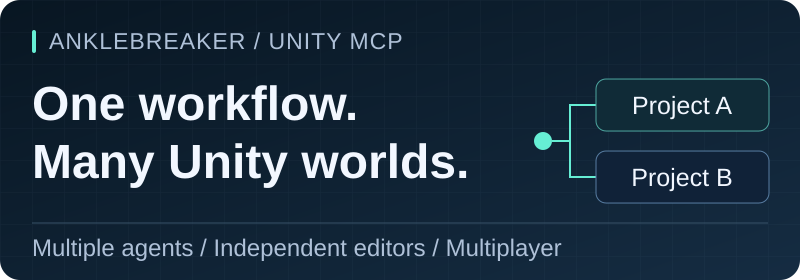

<p align="center">
  
</p>

# AnkleBreaker Unity MCP Plugin

**The Unity side of a workflow built for multiple projects, multiple agents and multiplayer iteration.** This UPM package runs the editor bridge used by the companion [AnkleBreaker MCP server](https://github.com/AnkleBreaker-Studio/unity-mcp-server).

[Install](#installation) · [Dashboard](#dashboard-and-monitoring) · [Architecture](#how-it-works) · [Validation](#compatibility-and-validation) · [Changelog](CHANGELOG.md)

| 338 registered editor routes | Fair scheduling between agents | Multiplayer scenario tools |
|:---:|:---:|:---:|
| Scenes through optional integrations | FIFO per agent, grouped reads | MPPM controls and clone discovery |

The server also provides Hub and connection tools. Route counts describe the checked-in dispatcher; optional integrations require their own packages.

## Installation

**Development preview:** this README describes `Development-Unity66-Modernization`, which has not been released. Install the same branch of both components to try the improvements below. The [default-branch README](https://github.com/AnkleBreaker-Studio/unity-mcp-plugin) describes the existing release line.

1. In Unity, open **Window → Package Manager → Add package from git URL**.
2. Add `https://github.com/AnkleBreaker-Studio/unity-mcp-plugin.git#Development-Unity66-Modernization`.
3. Open **Window → AB Unity MCP → Dashboard** and check the bridge status.
4. Install and configure the [Node MCP server](https://github.com/AnkleBreaker-Studio/unity-mcp-server/tree/Development-Unity66-Modernization#get-started).
5. From your MCP client, call `unity_list_instances`, select your project, then call `unity_editor_state`.

The default port is 7890; multiple editors can claim different ports. Discover the current project and port instead of assuming it remains the same after a restart. Browser navigation to the internal HTTP bridge is not the supported verification flow.

### Requirements

- Unity **2021.3.18f1 or newer** is the declared compatibility floor.
- uGUI and Unity Test Framework are declared UPM dependencies because editor command classes compile against their APIs. The manifest uses minimum versions compatible with older supported editors; Unity 6.6 resolves its built-in versions.
- The companion Node server and an MCP client are needed for AI-driven operations.

Server and plugin versions advance independently. Queue and legacy synchronous paths remain available; version numbers do not need to match.

The current companion server verifies the resolved identity when selecting by name and prevents stale discovery from replacing a newer project choice. Per-agent selections stay independent; include the discovered `port` on concurrent editor calls. [Selection behavior and evidence](https://github.com/AnkleBreaker-Studio/unity-mcp-server/blob/Development-Unity66-Modernization/docs/discovery.md).

On the modernization branch, protocol 2 adds protected submission retries and session-scoped polling. An updated server can recover the original ticket when its acknowledgement is lost. Older clients keep using their existing endpoints; their retry behavior does not change. [Protocol and compatibility details](https://github.com/AnkleBreaker-Studio/unity-mcp-server/blob/Development-Unity66-Modernization/docs/queue-protocol.md).

## What you can do

| Author | Inspect and verify | Coordinate |
|---|---|---|
| Scenes, objects, components and references | Scene hierarchy and search | Multiple editor projects |
| Prefabs, materials and ScriptableObjects | Console and compilation diagnostics | Per-agent queues and history |
| Animation, terrain, particles and audio | EditMode / PlayMode test jobs | MPPM scenarios and players |
| UI, lighting, navigation and builds | Screenshots, profiling and memory | ParrelSync clone discovery |
| Scripts and editor code | Named undo for supported writes | Project-specific context files |

Optional integrations include ProBuilder, UMA, Amplify Shader Editor, Shader Graph, VFX Graph, Input System, Memory Profiler and Multiplayer Play Mode. Discover their tools through `unity_list_advanced_tools`; the plugin reports unavailable packages or disabled categories instead of requiring every integration in every project.

UMA uses a separate assembly enabled by `UMA_INSTALLED`, keeping its references out of the core bridge. UMA V3.1f1 creation and rename workflows now pass on Unity 6.6, including legacy recipe references and preservation after file collisions. Actual UMA 2 execution and runtime avatar rendering remain unverified. [UMA setup, evidence and reproduction](https://github.com/AnkleBreaker-Studio/unity-mcp-server/blob/Development-Unity66-Modernization/docs/uma.md).

<details>
<summary><strong>See a scene built with Unity MCP</strong></summary>

<p align="center"></p>

Other existing demonstrations: [brick breaker](docs/unity-mcp-showcase-brickbreaker.gif) and [castle](docs/unity-mcp-showcase-castle.gif).

</details>

## Dashboard and monitoring

Open **Window → AB Unity MCP → Dashboard** in the project you want to inspect. Bridge controls, queue activity, agent cards and recent actions come first. Sections remember their state per project; long names and requests remain available in tooltips.

**HTTP Activity** adds response codes, active/peak requests, body traffic, rejected input, serialization failures and handler timings. Reload counts persist for the editor session; HTTP counters reset on domain reload. These transport counters stay separate from command outcomes. [Fields, limits and validation](https://github.com/AnkleBreaker-Studio/unity-mcp-server/blob/Development-Unity66-Modernization/docs/http-monitoring.md).

| Inspect | What you can see |
|---|---|
| **Queue** | Pending/running counts, per-agent backlog and retention counters through `unity_queue_info`. |
| **Agents** | Attribution, outcomes and average queue-wait/processing times through `unity_agents_list`. |
| **History** | Request logs through `unity_agent_log`; action records and supported undo groups through `unity_undo_history`. |
| **Code execution** | Compiler-reference cache sizes, hits/misses and loaded snippet assemblies through `unity_editor_state.codeExecution`. |

Cards update in place. A measured changing-agent workload records **83% fewer allocation events** than the baseline; layout and rendering are excluded. Twenty small code-execution calls fell from **15.85 s to 1.01 s** in a separate Unity 6.6 fixture. These are workload-specific measurements. [Dashboard evidence](https://github.com/AnkleBreaker-Studio/unity-mcp-server/blob/Development-Unity66-Modernization/docs/dashboard.md) / [Execution evidence](https://github.com/AnkleBreaker-Studio/unity-mcp-server/blob/Development-Unity66-Modernization/docs/code-execution.md).

Outstanding work keeps a session visible. At most 1,024 sessions without outstanding work are retained, including recently completed identities; inactive sessions also expire after 30 minutes, with at most 256 retained after periodic cleanup. A returning evicted identity starts fresh counters and logs. Ticket completion is atomic, and late callbacks cannot replace a terminal result or count it twice. A timeout does not cancel work that already started or prove that no changes occurred.

[Monitoring fields, errors, history and retention](https://github.com/AnkleBreaker-Studio/unity-mcp-server/blob/Development-Unity66-Modernization/docs/queue-monitoring.md) / [Ticket deadlines and retry behavior](https://github.com/AnkleBreaker-Studio/unity-mcp-server/blob/Development-Unity66-Modernization/docs/queue-protocol.md).

## How it works

[View the routing diagram](Documentation~/workflow.svg) / [Full architecture guide](https://github.com/AnkleBreaker-Studio/unity-mcp-server/blob/Development-Unity66-Modernization/docs/architecture.md).

1. The MCP server sends a command with agent identity to the local bridge.
2. The bridge returns a queue ticket. Legacy calls wait on a ticket internally.
3. `EditorApplication.update` processes one write or up to five explicitly classified reads, visiting agent queues fairly. Unknown routes use the write path.
4. Commands execute on Unity's main thread; deferred Unity APIs complete through callbacks.
5. The MCP server polls the original ticket and returns text or images to the client.

Pending tickets are indexed by ID, avoiding a scan across every agent queue on each status request. Supported synchronous writes get individual named undo groups. Deferred commands do not collapse undo groups across intervening work from other agents.

Each editor has its own listener, queue and project identity. The server handles request isolation and per-call routing. The plugin handles editor scheduling, history, optional integrations and reload lifecycle. Heavy Unity operations still occupy the main thread; queueing does not make arbitrary editor work non-blocking.

### Local access and undo

The bridge binds to loopback and checks incoming browser/host metadata. It is intended for the companion server on the same machine. Local code-execution tools have the authority of the editor process, so use trusted MCP clients. Queueing orders requests; it does not resolve conflicting edits by different agents. Undo applies to commands that register supported Unity undo operations, not every possible command or filesystem change.

## Compatibility and validation

The declared minimum remains **Unity 2021.3.18f1**. All 77 editor sources included in the minimum-version API compiler check pass. Actual older-editor execution is deferred; current live validation uses **Unity 6000.6.2f1 on Windows**.

| Coverage | Verified behavior |
|---|---|
| [Server-plugin matrix](https://github.com/AnkleBreaker-Studio/unity-mcp-server/blob/Development-Unity66-Modernization/docs/compatibility.md) | All four released/current pairs with Node 18 and 22; object edits, undo, errors, history and concurrent agents across mixed plugin versions. |
| [Queue and monitoring](https://github.com/AnkleBreaker-Studio/unity-mcp-server/blob/Development-Unity66-Modernization/docs/queue-monitoring.md) | Fair scheduling, read batching, duplicate/late callbacks, real timeout races, retention and error history. |
| [Action History](https://github.com/AnkleBreaker-Studio/unity-mcp-server/blob/Development-Unity66-Modernization/docs/history-notifications.md) | Bounded observer backlog, grouped window refreshes, stable selection/filters and real reload checks. |
| [History window](https://github.com/AnkleBreaker-Studio/unity-mcp-server/blob/Development-Unity66-Modernization/docs/history-window.md) | Visible-row drawing, native texture cleanup, scroll/selection tests and measured allocation-event counts. |
| [Agent sessions](https://github.com/AnkleBreaker-Studio/unity-mcp-server/blob/Development-Unity66-Modernization/docs/session-retention.md) | Bounded completed identities, protected busy work and separate history for returning identities. |
| [History persistence](https://github.com/AnkleBreaker-Studio/unity-mcp-server/blob/Development-Unity66-Modernization/docs/history-persistence.md) | Validated retention-aware restoration, bounded snapshots, recoverable failures and native Undo across reload. |
| [Package Manager](https://github.com/AnkleBreaker-Studio/unity-mcp-server/blob/Development-Unity66-Modernization/docs/packages.md) | Sequential requests across editor updates, expiration cleanup, legacy responses and local package add/remove with manifest restoration. |
| [Result serialization](https://github.com/AnkleBreaker-Studio/unity-mcp-server/blob/Development-Unity66-Modernization/docs/code-execution.md) | Valid JSON, bounded conversion/traversal and early HTTP byte limits; execution is not repeated after response failure. |
| [Server HTTP downloads](https://github.com/AnkleBreaker-Studio/unity-mcp-server/blob/Development-Unity66-Modernization/docs/response-limits.md#node-http-downloads) | The companion server bounds response reads with current and released plugins; overflow preserves unknown-outcome recovery without repeating commands. |
| [Request input](https://github.com/AnkleBreaker-Studio/unity-mcp-server/blob/Development-Unity66-Modernization/docs/request-input.md) | Complete HTTP/JSON before ticket creation, 8 body readers, 64 MiB reservations and a 30-second upload deadline; limits advertised for server preflight checks. |
| [Undo across agents](https://github.com/AnkleBreaker-Studio/unity-mcp-server/blob/Development-Unity66-Modernization/docs/undo.md) | Native stack/session checks, explicit cascade handling and action identity preserved through script reload. |
| [Test Runner](https://github.com/AnkleBreaker-Studio/unity-mcp-server/blob/Development-Unity66-Modernization/docs/testing.md) | Failure cleanup, native cancellation, accurate results and retained job details through script reload. |
| [Editor workflows](https://github.com/AnkleBreaker-Studio/unity-mcp-server/blob/Development-Unity66-Modernization/docs/editor-workflows.md) | Scene reopening, enum/flags properties, object references, material/prefab assets and Scene capture cleanup. |
| [Inline captures](https://github.com/AnkleBreaker-Studio/unity-mcp-server/blob/Development-Unity66-Modernization/docs/graphics-capture.md) | Camera selection, dimension bounds, borrowed render-target restoration and decoded PNG checks on Built-in/Direct3D12. |
| [Asset previews](https://github.com/AnkleBreaker-Studio/unity-mcp-server/blob/Development-Unity66-Modernization/docs/asset-previews.md) | Deferred loading lets other agents progress; requested sizes and metadata-only options are honored, with native preview pixels preserved. |
| [Mesh metadata](https://github.com/AnkleBreaker-Studio/unity-mcp-server/blob/Development-Unity66-Modernization/docs/mesh-metadata.md) | Both object-path names, eight UV channels and native triangle counts; geometry buffers are no longer copied for metadata. |
| [Multiplayer](https://github.com/AnkleBreaker-Studio/unity-mcp-server/blob/Development-Unity66-Modernization/docs/multiplayer.md) | MPPM 3.0 Host/Client launch, independent agent routing and shared script recompilation. |
| [ParrelSync](https://github.com/AnkleBreaker-Studio/unity-mcp-server/blob/Development-Unity66-Modernization/docs/parrelsync.md) | Native marker/parent identity, 48 overlapping calls per Node version through Play Mode, recompilation and restart, plus settings persistence. |
| [Builds](https://github.com/AnkleBreaker-Studio/unity-mcp-server/blob/Development-Unity66-Modernization/docs/builds.md) | Five Windows Mono builds verify managed diagnostics and restoration of project settings. |
| [Editor lifecycle](https://github.com/AnkleBreaker-Studio/unity-mcp-server/blob/Development-Unity66-Modernization/docs/modernization.md) | Two editors, four Play Mode reload configurations and lost-result handling after script reload. |
| [Dashboard](https://github.com/AnkleBreaker-Studio/unity-mcp-server/blob/Development-Unity66-Modernization/docs/dashboard.md) | Card reuse, section persistence through script reload, 360 px geometry and actual Windows pixel review at 360/640 px. |

Older MPPM/ParrelSync versions, game networking, other OS/build platforms and additional optional packages need separate validation. [Full evidence and remaining work](https://github.com/AnkleBreaker-Studio/unity-mcp-server/blob/Development-Unity66-Modernization/docs/modernization.md).

<details>
<summary><strong>Reproduce the Unity checks</strong></summary>

From the plugin repository, with an installed editor and a disposable project directory:

```powershell
./tools~/validate-unity.ps1 -EditorPath 'C:/Program Files/Unity/Hub/Editor/6000.6.2f1/Editor/Unity.exe' -ProjectPath 'C:/UnityMcpValidation/Unity66'
```

The runner launches Unity hidden in batch mode, refuses an unmarked existing project and writes reports under `Library`. Unity ignores the development tools under `tools~` during package import.

| Suite option | Scope |
|---|---|
| Default | Queue, HTTP dispatch, callbacks and timeout races |
| `-Suite QueueAdmission` | HTTP command count/argument budgets, replay at capacity and terminal release; [limits and evidence](https://github.com/AnkleBreaker-Studio/unity-mcp-server/blob/Development-Unity66-Modernization/docs/command-admission.md) |
| `-Suite ResultRetention` | Completed-result budgets, history payload release and protected/synchronous recovery; [limits and evidence](https://github.com/AnkleBreaker-Studio/unity-mcp-server/blob/Development-Unity66-Modernization/docs/result-retention.md) |
| `-Suite SessionRetention` | Recent identity pressure, busy-agent protection, returning generations, replay/results and weak-reference release; [limits and evidence](https://github.com/AnkleBreaker-Studio/unity-mcp-server/blob/Development-Unity66-Modernization/docs/session-retention.md) |
| `-Suite ParrelSync` | Native marker, numeric/unknown index and original-project identity without the optional package installed; [live lifecycle evidence](https://github.com/AnkleBreaker-Studio/unity-mcp-server/blob/Development-Unity66-Modernization/docs/parrelsync.md) |
| `-Suite HistoryNotifications` | Deferred observer delivery, pressure/clear/reentrancy, weak-reference collection, grouped window updates and stable selection/filters |
| `-Suite HistoryPersistence` | File/retention limits, transactional loading, failed-save recovery, legacy identity/schema and Undo metadata |
| `-Suite Health` | Session retention, read/write scheduling and idle queue allocations |
| `-Suite Monitoring` | Error classification, history, persistence and create/undo |
| `-Suite RequestInput` | Byte/Unicode boundaries, strict request parsing, queue/legacy/deferred rejection and guarded submission compatibility |
| `-Suite RequestBody` | Declared/chunked framing, fragmented trailers, reader/byte admission, absolute deadlines and interruption cleanup |
| `-Suite Undo` | Native Undo/Redo eligibility, agent/native cascades, session identity, group changes and history-window confirmation checks |
| `-Suite Serialization` | JSON validity, output/traversal budgets, result conversion and owned HTTP writer checks |
| `-Suite Testing` | Test Runner settings, callbacks, cancellation and UTC restoration |
| `-Suite TestResults` | Discovery limits and authoritative final counts/details |
| `-Suite TestPersistence` | Reload snapshots, native identity, corruption and history retention |
| `-Suite RequestShutdown` | HTTP worker interruption without a false Unity error |
| `-Suite Dashboard` | Card reuse, refresh allocations, interface reconstruction and saved preferences |
| `-Suite HttpDiagnostics` | HTTP status/byte counters, input rejection, output failures and aggregate invariants |
| `-Suite EditorCapture` | Windows capture selection, tab restoration, native pixels, GDI/texture cleanup and image bounds |
| `-Suite GraphicsCapture` | Inline camera/asset pixels, invalid dimensions, render-target restoration and warmed texture counts; requires a graphics device |
| `-Suite AssetPreview` | Preview options, render-state restoration, bounded deferred polling, expiry and fallback; requires a graphics device |
| `-Suite MeshMetadata` | Object-path aliases, UV channels, primitive counts, shared resources, asset lookup and measured metadata costs |

Batch UI checks exclude interactive rendering. The measured empty queue loop has zero allocation events after warmup; this is not a whole-plugin allocation claim.

Verify the route registry with `node tools~/generate-routes.mjs --check`. The server repository contains the stdio, compatibility and concurrent-routing suites.

</details>

## Support and license

[Report an issue](https://github.com/AnkleBreaker-Studio/unity-mcp-plugin/issues) with Unity, plugin and server versions and the affected operation. Support development through [GitHub Sponsors](https://github.com/sponsors/AnkleBreaker-Studio) or [Patreon](https://www.patreon.com/AnkleBreakerStudio).

Distributed under the **AnkleBreaker Open License v1.0**. See [LICENSE](LICENSE) for attribution requirements and restrictions on reselling the tool. AI client/model costs are separate.
